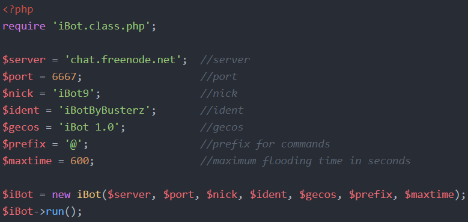

# iBotlib
Welcome to iBot (I know, I could do better on the name). This is a simple IRC bot library with a built-in Denial-of-Service function.

## Install
`
$ git clone https://github.com/LulzAmp/iBotlib.git
`

## Initialisation
Well, if you look at the screenshot below. Also,
  
Save this file as bot.php.

## Usage
**Make sure you have got _PHP_ installed.**  
`
$ php bot.php
`  
or  
`
$ php.exe bot.php
`  
to start the bot.

## Commands
This really all depends on the prefix you decided to choose at the initialisation. I'll just use '@' as prefix, for the sake of example.
* **@ihelp** - displays this help message
* **@iddos** < method > < ip > < port > < time > - launches a DoS attack
* **@ijoin** < chan > [< password >] - makes the bot join a specific channel
* **@ileave** < chan > - makes the bot leave a specific channel
* **@joinchans** - makes the bot join all channels specified in [this array](https://github.com/LulzAmp/iBotlib/iBot.class.php#L10)
* **@leavechans** - makes the bot leave all channels specified in [this array](https://github.com/LulzAmp/iBotlib/iBot.class.php#L10)
* **@iquit** - makes the bot quit IRC

*arguments between [ and ] are optional  
That's all you need to know, have fun!
